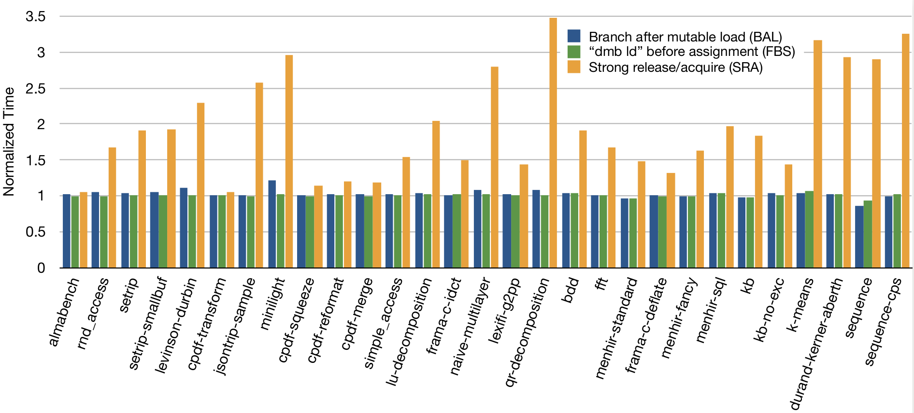

class: middle, titleslide, firstslide
count: false

# Bounding Data Races in Space and Time

**Stephen Dolan**  
**KC Sivaramakrishnan**  
**Anil Madhavapeddy**  

.vspace[]

University of Cambridge

---

# Memory models

Threads used to run step-by-step, interleaving their steps on a single processor.

---
count:false
# Memory models

**Today, everything happens at the same time as everything else**

  - Processors overlap and reorder instructions

  - Cores see changes at different times

  - Compilers reorder instructions by themselves

Determining what a multithreaded program will do requires understanding the **memory model**.

--

This is hard.

---
# SC-DRF

.vspace[]

If you mark as **atomic** every variable that might be accessed concurrently from multiple threads,

&nbsp;

.vspace[]

then the behaviour will be as though the threads were simply interleaved.

---
count:false
# SC-DRF

.vspace[]

If you mark as **atomic** every variable that might be accessed concurrently from multiple threads,

.indent[**(data-race-free)**]

.vspace[]

then the behaviour will be as though the threads were simply interleaved

.indent[**(sequentially consistent)**]


---
# SC-DRF

Shorter version:

.center[
**Data-race-free programs have sequential semantics**
]

--

The assumption is global:

  - *any* data race,
  - on *any* location,
  - at *any* time,
  
means SC-DRF doesn't apply.


---

# What can we expect?

--
.vspace[]

.center[
**If I read a variable twice,  
with no concurrent writes to that variable,  
then I get the same value both times**
]
.vspace[]

--

This is false in both C++ and Java. Reads are affected by:

  - data races on other variables (C++)
  - data races at other times (C++, Java)

---

# Our contributions

SC-DRF says:

.center[
**Data-race-free programs have sequential semantics**
]

---
count:false
# Our contributions

We introduce the Local DRF property:

.center[
**All data-race-free parts of programs have sequential semantics**
]

--

and provide:

--

  - Examples demonstrating that Local DRF fails in C++ and Java
  
--

  - A memory model for which Local DRF holds
  
--

  - Proven-correct compilation schemes for our model to x86 and ARMv8
  
--

  - Empirical performance data for our model as implemented for OCaml.


---
class: center, middle, titleslide
count: false
# Examples

---

# Data races elsewhere


.col-left[
```


  b = a + 10;
```
]

**Assumption**: no other accesses to `b` or `a`.

**Expected result**: afterwards, `b == a + 10`.

---

# Data races elsewhere

.col-left[
```
  c = a + 10;
  ... // some computation
  b = a + 10;
```
]
.col-right[
```
  c = 1;
  
  
```
]

---
count:false
# Data races elsewhere

.col-left[
```
* c = a + 10;
  ... // some computation
  b = a + 10;
```
]
.col-right[
```
* c = 1;


```
]

---
count:false
# Data races elsewhere

.col-left[
```
* c = a + 10;
  ... // some computation
* b = a + 10;
```
]
.col-right[
```
  c = 1;
  
  
```
]


---
count:false
# Data races elsewhere

.col-left[
```
  t = a + 10;
  c = t;
  ... // some computation
  b = t;
```
]
.col-right[
```
  c = 1;
  
  
```
]

---
count:false
# Data races elsewhere

.col-left[
```
  t = a + 10;
  c = t;
  ... // some computation
  b = c;
```
]
.col-right[
```
  c = 1;
  
  
```
]

--
Now `b = 1` is possible!


---

# Data races in the past


.col-left[
```


  b = a;
  c = a;
```
]

**Assumption**: no concurrent accesses to `a`, `b` or `c`.

**Expected result**: afterwards, `b == c`.

---
# Data races in the past

.col-left[
```
  a = 2;
  f = Flag;
  b = a;
  c = a;
```
]
.col-right[
```
  a = 1;
  Flag = true;
  
  
```
]

`Flag` is an atomic location (in Java, `volatile`).

Suppose `f` is `true` afterwards.

---
count: false
# Data races in the past

.col-left[
```
* a = 2;
  f = Flag;
  b = a;
  c = a;
```
]
.col-right[
```
* a = 1;
  Flag = true;
  
  
```
]

`Flag` is an atomic location (in Java, `volatile`).

Suppose `f` is `true` afterwards.


---
count: false
# Data races in the past

.col-left[
```
  a = 2;
* f = Flag;
  b = a;
  c = a;
```
]
.col-right[
```
  a = 1;
* Flag = true;


```
]

`Flag` is an atomic location (in Java, `volatile`).

Suppose `f` is `true` afterwards.

---
count: false
# Data races in the past

.col-left[
```
  a = 2;
  f = Flag;
* b = a;
* c = a;
```
]
.col-right[
```
  a = 1;
  Flag = true;
  
  
```
]

`Flag` is an atomic location (in Java, `volatile`).

Suppose `f` is `true` afterwards.


---
count: false
# Data races in the past

.col-left[
```
  a₀ = 2;
  f = Flag;
* b = a₀;
* c = a₁;
```
]
.col-right[
```
  a₁ = 1;
  Flag = true;
  
  
```
]

`Flag` is an atomic location (in Java, `volatile`).

Suppose `f` is `true` afterwards.


---
count: false
# Data races in the past

.col-left[
```
  a₀ = 2;
  f = Flag;
* b = 2;
* c = a₁;
```
]
.col-right[
```
  a₁ = 1;
  Flag = true;
  
  
```
]

`Flag` is an atomic location (in Java, `volatile`).

Suppose `f` is `true` afterwards.


---
count: false
# Data races in the past

.col-left[
```
  a₀ = 2;
  f = Flag;
  b = 2;
  c = a₁;
```
]
.col-right[
```
  a₁ = 1;
  Flag = true;
  
  
```
]

`Flag` is an atomic location (in Java, `volatile`).

Suppose `f` is `true` afterwards.

Now `b = 2, c = 1` is possible!


---

# Data races in the future

.col-left[
```
  C c = new C();
  c.x = 42;
  a = c.x;
  
```
]

**Assumption**: no other accesses to `a`.

**Expected result**: afterwards, `a == 42`.

---

# Data races in the future

.col-left[
```
  C c = new C();
  c.x = 42;
  a = c.x;
  g = c;
```
]
.col-right[
```


  g.x = 7;
```
]


---
count: false
# Data races in the future

.col-left[
```
  C c = new C();
  c.x = 42;
* a = c.x;
* g = c;
```
]
.col-right[
```


  g.x = 7;
```
]

---
count: false
# Data races in the future

.col-left[
```
  C c = new C();
  c.x = 42;
* g = c;
* a = c.x;
```
]
.col-right[
```


  g.x = 7;
```
]

--

Now `a == 7` is possible!


---
class: center, middle, titleslide
count: false
# Local DRF

---
# Formalising local DRF

.vspace[]

.center[
<br>
**All data-race-free parts of programs have sequential semantics**
]
.vspace[]

---
# Machine states

.vspace[]
$$M$$
.vspace[]

A **machine state** \\(M\\) consists of **threads** and a **store**
(mapping locations to values).


---
# Transitions

.vspace[]
$$M \xrightarrow{T} M'$$
.vspace[]

A **transition** \\(T\\) is an action by a single thread, moving from state \\(M\\) to \\(M'\\).  
e.g. by reading or writing a location.

---
# Traces

.vspace[]
$$M_0 \xrightarrow{T_0} M_1 \xrightarrow{T_1} M_2 \xrightarrow{T_2} \dots \xrightarrow{T_n} M_n$$
.vspace[]

A **trace** is a sequence of transitions, starting from the **initial state** \\(M_0\\) (which has all locations zero).

--

An **SC trace** is one that contains no non-sequentially-consistent actions (**weak transitions**).

---
# Happens-before

.vspace[]
$$M_0 \xrightarrow{T_0} M_1 \xrightarrow{T_1} M_2 \xrightarrow{T_2} \dots \xrightarrow{T_n} M_n$$
.vspace[]

**Happens-before** is a transitive binary relation between transitions \\(T_i\\), \\(T_j\\) (\\(i < j\\)).

--

\\(T_i\\) happens-before \\(T_j\\) if:

  - \\(T_i\\) and \\(T_j\\) occur on the same thread, or
  - \\(T_i\\) is a write and \\(T_j\\) is a read or write to the same atomic location.

--

\\(T_i\\) **happens concurrently** with  \\(T_j\\) if neither happens-before the other.

---

# Data races

.vspace[]
$$M_0 \xrightarrow{T_0} M_1 \xrightarrow{T_1} M_2 \xrightarrow{T_2} \dots \xrightarrow{T_n} M_n$$
.vspace[]

A **data race** is a pair of transitions \\(T_i\\), \\(T_j\\), which

  - happen concurrently
  - access the same nonatomic location
  - are not both reads

---

# SC-DRF

.col-left.blob[
*Theorem (SC-DRF):*

If there are no data races  
.hskip[] in any SC traces  
.hskip[] starting from \\(M_0\\),

then any state reachable from \\(M_0\\)  
.hskip[] is also reachable by an SC
trace.
]

---
# Data races elsewhere


.col-left.blob[
*Theorem:*

If there are no data races  
.hskip[] in any SC traces  
.hskip[] starting from \\(M_0\\),

then any state reachable from \\(M_0\\)  
.hskip[] is also reachable by an SC
trace.
]

--

.col-right[
.vspace[]
A transition is \\(L\\)-**sequential** if it is sequential, or affects only locations not in \\(L\\).
]

---
count:false
# Data races elsewhere

.col-left.blob[
*Theorem:*

If there are no data races  
.hskip[] in any **\\(L\\)-sequential traces**  
.hskip[] starting from \\(M_0\\),

then any state reachable from \\(M_0\\)  
.hskip[] is also reachable by an **\\(L\\)-sequential trace**.
]

.col-right[
.vspace[]
A transition is \\(L\\)-**sequential** if it is sequential, or affects only locations not in \\(L\\).
]

---
# Data races in the past

.col-left.blob[
*Theorem:*

If there are no data races  
.hskip[] in any \\(L\\)-sequential traces  
.hskip[] starting from \\(M_0\\),

then any state reachable from \\(M_0\\)  
.hskip[] is also reachable by an \\(L\\)-sequential trace.
]

--
.col-right[
.vspace[]
A state is \\(L\\)-**stable** if it has no active data races on \\(L\\).
]

---
count:false
# Data races in the past

.col-left.blob[
*Theorem:*

If there are no data races  
.hskip[] in any \\(L\\)-sequential traces  
.hskip[] starting from **any \\(L\\)-stable \\(M\\)**,

then any state reachable from \\(M\\)  
.hskip[] is also reachable by an \\(L\\)-sequential trace.
]

.col-right[
.vspace[]
A state is \\(L\\)-**stable** if it has no active data races on \\(L\\).
]

---
# Data races in the future

.col-left.blob[
*Theorem:*

If there are no data races  
.hskip[] in any \\(L\\)-sequential traces  
.hskip[] starting from any \\(L\\)-stable \\(M\\),

then any state reachable from \\(M\\)  
.hskip[] is also reachable by an \\(L\\)-sequential trace.
]

--

.col-right[
.vspace[]
Instead of the entire trace, reason about the next step.
]

---
count:false
# Data races in the future

.col-left.blob[
*Theorem (Local DRF):*

If there are no data races  
.hskip[] in **the next step of an** \\(L\\)-sequential trace  
.hskip[] starting from any \\(L\\)-stable \\(M\\),

then **the next step**  
.hskip[] will be \\(L\\)-sequential.
]

.col-right[
.vspace[]
Instead of the entire trace, reason about the next step.
]

---
# Local DRF

.col-left.blob[
*Theorem (Local DRF):*

If there are no data races  
.hskip[] in the next step of an \\(L\\)-sequential trace  
.hskip[] starting from any \\(L\\)-stable \\(M\\),

then the next step  
.hskip[] will be \\(L\\)-sequential.
]


---
class: center, middle, titleslide
count: false
# Implementing Local DRF

---

# A memory model with Local DRF

Our proposed memory model:

  - has the local DRF property
  - is efficiently implementable, even on weak architectures

Not the first with either property, but the first with both.

--

  - no overhead for sequential code on x86

--
  - low overhead for sequential code on ARMv8

--
  - supports most compiler optimisations (e.g. CSE, LICM)  
--
<br>.hskip[] (but not all: no redundant store elimination across a load)

---

# Compiling to ARMv8

Our only overhead on ARMv8 is that we must **preserve load-to-store ordering**.

--

Between a load and a subsequent store, there must be **any of**:

  1. a branch depenedent on the value loaded

  2. a load whose address is derived from the value loaded

  3. a `dmb ld` (or stronger) fence

--

GCs with read barriers already insert 1. or 2.

---

# Performance on ARMv8

.center[

]


---
class: middle, titleslide
count: false
# Questions?

.center[
`stephen.dolan@cl.cam.ac.uk`
]


---
class: middle, titleslide
count: false
# Thanks!

&nbsp;

---
count:false
# CSE

.col-left[
```
a = x;
b = x';
c = x;
```
]
.col-right[
```
x = 1;
```
]
What if `x` and `x'` are the same location?

CSE makes `0, 1, 0` possible.
